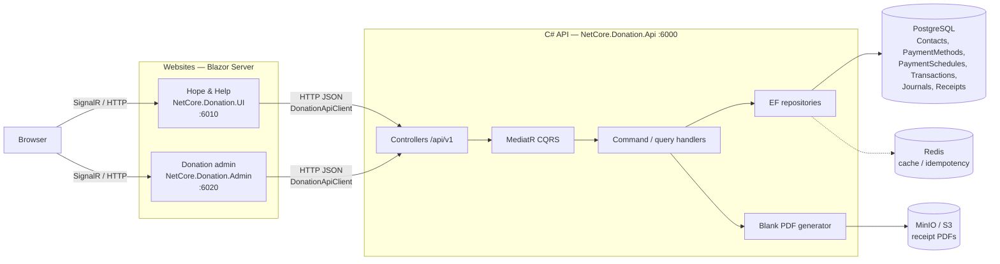
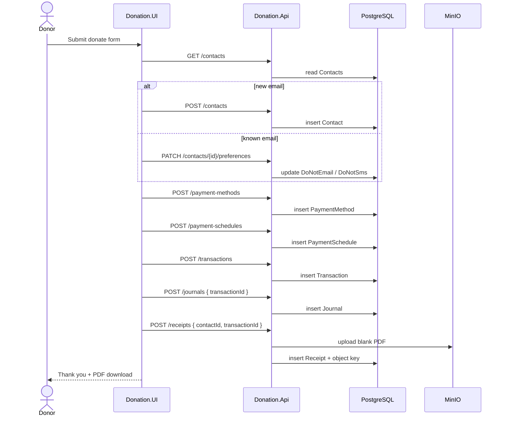
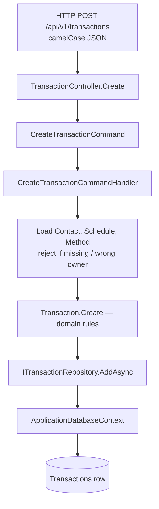

# Data flow — website to C# API to database

Local architecture for the COSC29800 donation system. Auth is not enabled. Email/SMS notification is not wired yet.

Use the mermaid blocks below in the report (GitHub, VS Code, Word via a mermaid add-in, or export from [mermaid.live](https://mermaid.live)).

## 1. Website → C# API → database

Browser talks to Blazor Server. The **server** calls the API over HTTP (`DonationApiClient`). Donation rows go to PostgreSQL. Receipt PDF bytes go to MinIO; receipt metadata stays in `Receipts`. Redis is beside the write path (cache / idempotency), not the system of record.

## 2. Donate click — one gift, six writes

The public site does not have a single “donate” API. One form submit issues the spine in order: contact (create or reuse by email) → payment method → schedule → transaction → journal → receipt.

Admin **reads** the same tables (`GET /contacts`, `/transactions`, `/journals`, `/receipts`) and downloads PDFs with `Accept: application/pdf`.

## 3. Inside one API request

Every create/update/delete follows Country-style CQRS: controller → MediatR command → handler → domain entity → EF repository → PostgreSQL. Query DTOs are kebab-case (`transaction-id`, `do-not-email`); write bodies are camelCase.

## Report notes

| In these diagrams | Not in this path yet |
|---|---|
| Two websites → one API → Postgres | JWT / Identity |
| Receipt bytes in MinIO, metadata in `Receipts` | SES / SNS notify |
| Journal requires `TransactionId` | Payment processor |
| Redis only beside the write path | Browser talking to the API directly |

Later cloud swap (same CQRS and tables): API Gateway + Lambda instead of Kestrel, RDS instead of local Postgres, S3 instead of MinIO.
